# How To Voronoi
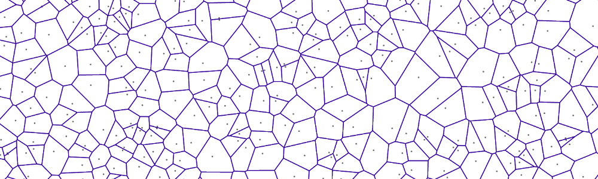
 

## Listings
1. [Parabolas](#PARABOLAS)
2. [Intersections](#INTERSECTIONS)
3. [Voronoi](#VORONOI)
4. [Fortune &AElig;lgorithm](#FORTUNE)
5. [Data Structure Speedup](#OPTIMUM)
6. [Delaunay](#DELAUNAY)
7. [References](#REFERENCES)

## Parabolas
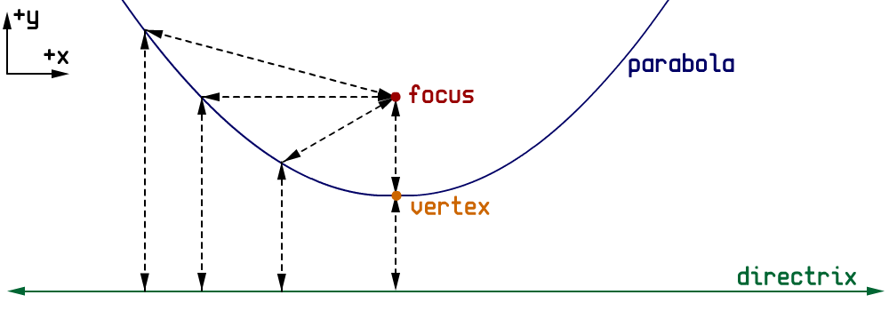
 

### Definitions

A Parabola is the locus (set) of points equal distance from a point and a line

**Directrix**: Reference Line - This can be in any direction, but is taken as a horizontal line **y = constant** (directrix.y)
 
**Focus**: Reference Point - a point anywhere in the 2D plane (focus.x,focus.y)
 
**Vertex**: Basically derived as the midpoint between the focus point and directrix line (focus.x,[focus.y+directrix.y]/2)
 

[2nd order parabolas are the locus of points equidistant from a point and a parabol, called a *pedal curve*]

**Distance between the focus point and a locus point:**
 
sqrt( (locus.x-focus.x)2 + (locus.y-focus.y)2 )
 

**Distance between the directrix line and a locus point:**
 
sqrt( (locus.y-directrix.y)2 )
 

**Setting the locus point equidistant from the focus point and directrix line:**
 
*locus = (x,y), focus = (a,b), directrix = (*,c)*
 
sqrt( (x-a)2 + (y-b)2  ) = sqrt( (y-c)2 )
 
(x-a)2 + (y-b)2 = (y-c)2
(x-a)2 + (y-b)(y-b) = (y-c)2
 
(x-a)2 + y2 + b2 - 2by = (y-c)2
 
(x-a)2 + y2 + b2 - 2by = (y-c)(y-c)
 
(x-a)2 + y2 + b2 - 2by = y2 + c2 - 2cy
 
(x-a)2 + b2 - 2by = c2 - 2cy
 
(x-a)2 + b2 - c2 - 2by = -2cy
 
(x-a)2 + b2 - c2 - 2by = -2cy
 
(x-a)2 + b2 - c2 = 2by - 2cy
 
(x-a)2 + b2 - c2 = 2y(b-c)
 
[(x-a)2 + b2 - c2] / [2(b-c)] = y
 
y = [(x-a)2 + b2 - c2] / [2(b-c)]
 

**Simplifed to:**
 
*&rarr;  e = 2(b-c)*
 
y = [(x-a)2 + b2 - c2] / [2(b-c)]
 
y = [(x-a)2 + b2 - c2] / e
 
y = [x2 + a2 - 2ax + b2 - c2] /e
 
y = [x2 - 2ax + a2 + b2 - c2] /e
 
y = x2/e - 2ax/e + (a2 + b2 - c2)/e
 
*&rarr;  A = 1/e, B = -2a/e, C = (a2 + b2 - c2)/e*
 
y = Ax2 + Bx + C
 

*'Standard Form' of a parabola is given as:* **(x-h)2 = 4p(y-k)**
 
**Directrix** = y = k-p
 
**Focus** = (h,k+p)
 
**Vertex** = (h,k)
 

**Turning this into a normal 2nd order polynomial equation yields:**
 
(x-h)2 = 4p(y-k)
 
x2 + h2 - 2hx = 4py - 4pk
 
x2 + h2 - 2hx + 4pk = 4py
(1/(4p))x2  ((-h)/(2p))x + (4pk+h2)/(4p) = y
 
**a**: 1/(4p), **b**: -h/(2p), **c**: (4pk+h2)/(4p)
 

**Also, Noting that the derivative of y = ax2 + bx + c  &rarr;  y' = 2ax + b**
 
The vertex is the maxima/minima of y, which is at the zero crossing of y' : 0 = 2ax + b
 
x = -b/(2a) is the x coordinate of the vertex.
 
**The Focus+Directrix pair can then simply be derived from the normal equation:**
 
h = -b/(2a)
 
k = ah2 + bh + c
 
p = 1/(4a)
 

### Conic Relation
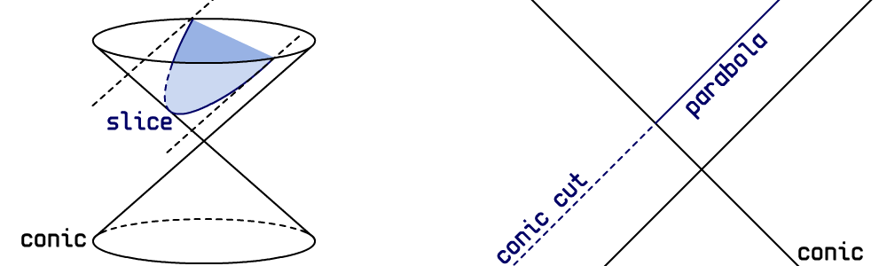
 
*The General equation of a conic is:*
 
Ax2 + Bxy + Cyx2 + Dx + Ey + F = 0

*A parabola is then a simplification:*
 
Ax2 + Dx + Ey + F = 0
 
y = -(A/E)x2 - (D/E)x - (F/E)
 
y = ax2 + bx + c

**A parabola is the intersection of a plane parallel to the edge of a cone**

**Eccentricity**: measure of how non-circular a conic is *(0=circle, (0,1)=ellipse, 1=parabola, (1,inf)=hyperbola, inf=non-circular)*
 
eccentricity = e := sqrt( [2sqrt((A-C)2+B2)]/[(A+C) + sqrt((A-C)2+B2)] )
 
@ B=0, C=0
 
e = sqrt( [2sqrt((A-0)2+02)]/[(A+0) + sqrt((A-0)2+02)] )
 
e = sqrt( [2sqrt(A2)]/[A + sqrt(A2)] )
 
e = sqrt( [2A]/[A + A] )
 
e = sqrt( 2A/2A )
 
e = sqrt( 1 )
 
e = 1

## Intersections
*Because curves are only interesting when they interact with other curves*

### Solving for Zero
**Finding the solutions of two simple examples, allows for plug-and-chug later on**
 

*Solving the linear equation: **Bx + C = 0**:*
 
Bx + C = 0
 
Bx = -C
 
x = -C/B
 
*Linear Solution:* **-C/B**
 

*Solving the non-linear (quadratic) equation: **Ax2 + Bx + C = 0**:*
 
Ax2 + Bx + C = 0
 
Ax2 + Bx = -C
 
A2x2 + ABx = -AC
 
A2x2 + ABx + B2 = B2 - AC
 
4A2x2 + 4ABx + 4B2 = 4B2 - 4AC
 
(2Ax + B)*(2Ax + B) = B2 - 4AC
 
(2Ax + B)2 = B2 - 4AC
 
2Ax + B = [+/-]sqrt(B2 - 4AC)
 
2Ax = -B [+/-]sqrt(B2 - 4AC)
 
x = [-B [+/-]sqrt(B2 - 4AC)]/[2A]
 
*&rarr; Quadratic Equation:* **[-B +/- sqrt(B2 - 4AC) ] / [2A]**

### Parabola-Line Intersections:
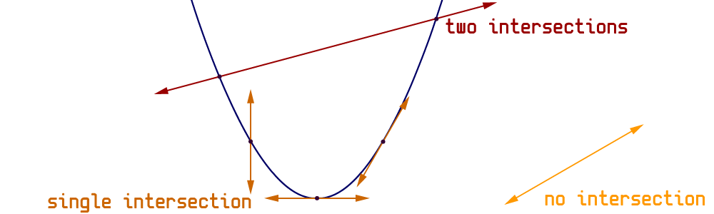
 

**Lines have multiple representations:**
 
*two points*: A, B
 
*slope and intercept*: y = mx + b
 
*ray*: origin, direction
 

Ray's are particularly useful representations, because they simplify calculations (remove repeated CPU operations), often we are only interested in the slope for various calculations/comparisons, and they are immediately useable for vector math.

**A line defined as two points can be converted to slope-intercept form:**
 
m = (B.y-A.y)/(B.x-A.x)
 
A.y = m&middot;A.x + b
 
b = A.y - m&middot;A.x
 

**A line defined as a ray can be converted to slope-intercept form:**
 
m = direction.y/direction.x
 
origin.y = m&middot;origin.x + b
 
b = origin.y - m&middot;origin.x 
 

**Parabola-Line Intersection: Set locations equal, solve for (x,y):**
 
**PARABOLA**: y = Ax2 + Bx + C
 
**LINE**: y = mx + b
 
Ax2 + Bx + C = mx + b
 
Ax2 + Bx + mx + C = b
 
Ax2 + Bx + mx + C - b = 0
 
Ax2 + (B+m)x + (C-b) = 0
 
Ax2 + B'x + C' = 0
 

**KEY NOTES:**
- If line is vertical (direction.x=0, A.x-B.x=0, m=inf) &rarr; single solution at y = f(A.x)
- If A equals 0 &rarr; single tangent point intersection: Bx + C = 0, solve linear equation
- If sqrt interrior (discriminant) equals 0 &rarr; single intersection at origin (also tangent)
- If sqrt interrior (discriminant) less-than zero &rarr; imaginary solutions, no intersection
- Else &rarr; 2 unique solutions, solve quadratic equation

*If the parabola is infinitely thin (focus.y=directrix.y) it is a vertical line &rarr; intersection(s) possibly exists at (focus.x,---)*

### Parabola-Parabola Intersections:
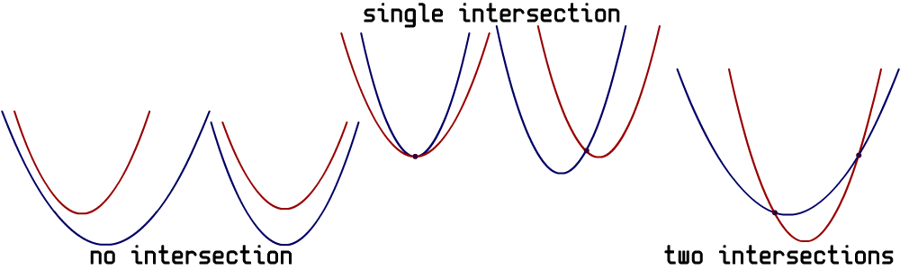
 

**Set locations equal, solve for (x,y)**
 
**PARABOLA 1**: y = ax2 + bx + c
 
**PARABOLA 2**: y = Ax2 + Bx + C
 
ax2 + bx + c = Ax2 + Bx + C
 
ax2 + bx + c - Ax2 - Bx - C = 0
 
(a-A)x2 + (b-B)x + (c-C)= 0
 
A'x2 + B'x + C' = 0
 

**KEY NOTES:**
 
- If two of (A,B,C) are zero and one is non-zero (A=0,B=0,C=#) &rarr; equation is inconsistent, no solution (equal parabolas, one above other)
- If all of (A,B,C) are zero &rarr; parabolas are identical, infinite solutions
- If A equals 0 &rarr; parabolas are identical up to shift, single point intersection: Bx + C = 0, solve linear equation
- If sqrt interrior (discriminant) equals 0 &rarr; single intersection, repeated ('thinner' parabola above other parabola)
- If sqrt interrior (discriminant) less-than zero &rarr; imaginary solutions, no intersection
- Else &rarr; 2 unique solutions, solve quadratic equation

*If A parabola is infinitely thin (focus.y=directrix.y) it is a vertical line &rarr; intersection(s) possibly exists at (focus.x,---)*

### Ray-Ray (Line) Intersections:
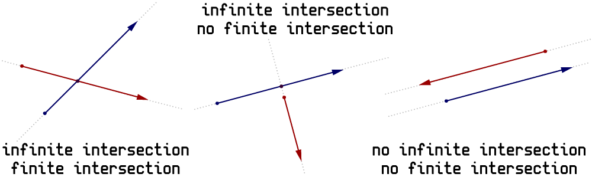
 
Ray = origin + direction, point along ray: point = origin + t&middot;direction
 

*Ray 1:* a + t1&middot;b
 
*Ray 2:* c + t2&middot;d
 

**Solving For t2:**
 
p.x = a.x + t1&middot;b.x
 
p.x = c.x + t2&middot;d.x
 
a.x + t1&middot;b.x = c.x + t2&middot;d.x
 
t1&middot;b.x = c.x - a.x + t2&middot;d.x
 
t1 = (c.x - a.x + t2&middot;d.x)/b.x  **[1]**
 

p.y = a.y + t1&middot;b.y
 
p.y = c.y + t2&middot;d.y
 
a.y + t1&middot;b.y = c.y + t2&middot;d.y
 
t1&middot;b.y = c.y - a.y + t2&middot;d.y
 
t1 = (c.y - a.y + t2&middot;d.y)/b.y  **[2]**
 

**[1]** = **[2]**
 
(c.x - a.x + t2&middot;d.x)/b.x = (c.y - a.y + t2&middot;d.y)/b.y
 
b.y(c.x - a.x + t2&middot;d.x) = b.x(c.y - a.y + t2&middot;d.y)
 
b.y&middot;c.x - b.y&middot;a.x + t2&middot;b.y&middot;d.x = b.x&middot;c.y - b.x&middot;a.y + t2&middot;b.x&middot;d.y
 
t2&middot;b.y&middot;d.x = b.x&middot;c.y - b.x&middot;a.y - b.y&middot;c.x + b.y&middot;a.x + t2&middot;b.x&middot;d.y
 
t2&middot;b.y&middot;d.x - t2&middot;b.x&middot;d.y = b.x&middot;c.y - b.x&middot;a.y - b.y&middot;c.x + b.y&middot;a.x
 
t2(b.y&middot;d.x - b.x&middot;d.y) = b.x&middot;c.y - b.x&middot;a.y - b.y&middot;c.x + b.y&middot;a.x
 
t2 = (b.x&middot;c.y - b.x&middot;a.y - b.y&middot;c.x + b.y&middot;a.x)/(b.y&middot;d.x - b.x&middot;d.y)
 
t2 = [b.x(c.y - a.y) + b.y(a.x - c.x)]/[b.y&middot;d.x - b.x&middot;d.y]
 

**Solving For t1:**
 
a.x + t1&middot;b.x = c.x + t2&middot;d.x
 
a.x - c.x + t1&middot;b.x = t2&middot;d.x
 
(a.x - c.x + t1&middot;b.x)/d.x = t2  **[3]**
 

a.y + t1&middot;b.y = c.y + t2&middot;d.y
 
a.y - c.y + t1&middot;b.y = t2&middot;d.y
 
(a.y - c.y + t1&middot;b.y)/d.y = t2  **[4]**
 

**[3]** = **[4]**
 
(a.x - c.x + t1&middot;b.x)/d.x = (a.y - c.y + t1&middot;b.y)/d.y
 
d.y&middot;(a.x - c.x + t1&middot;b.x) = d.x&middot;(a.y - c.y + t1&middot;b.y)
 
d.y&middot;a.x - d.y&middot;c.x + t1&middot;d.y&middot;b.x) = d.x&middot;a.y - d.x&middot;c.y + t1&middot;d.x&middot;b.y
 
t1&middot;d.y&middot;b.x) = d.x&middot;a.y - d.x&middot;c.y - d.y&middot;a.x + d.y&middot;c.x + t1&middot;d.x&middot;b.y
 
t1&middot;d.y&middot;b.x - t1&middot;d.x&middot;b.y = d.x&middot;a.y - d.x&middot;c.y - d.y&middot;a.x + d.y&middot;c.x
 
t1(d.y&middot;b.x - d.x&middot;b.y) = d.x&middot;a.y - d.x&middot;c.y - d.y&middot;a.x + d.y&middot;c.x
 
t1 = (d.x&middot;a.y - d.x&middot;c.y - d.y&middot;a.x + d.y&middot;c.x)/(d.y&middot;b.x - d.x&middot;b.y)
 
t1 = [d.x(a.y - c.y) + d.y(c.x - a.x)]/[d.y&middot;b.x - d.x&middot;b.y]
 

**Side-By-Side:**
 
t1 = [d.x(a.y - c.y) + d.y(c.x - a.x)]/[d.y&middot;b.x - d.x&middot;b.y]
 
t2 = [b.x(c.y - a.y) + b.y(a.x - c.x)]/[b.y&middot;d.x - b.x&middot;d.y]
 

**KEY NOTES:**
- If the demonimator equals zero &rarr; there are zero or infinite intersections
- Else &rarr; there is an intersection at t1 (Ray 1) and t2 (Ray 2)
- To limit to only positive intersections (infinite rays) &rarr; check that t1>=0 and t2>=0
- To limit to only finite rays &rarr; check that 0<=t1<=1 and 0<=t2<=1

## Voronoi Diagram
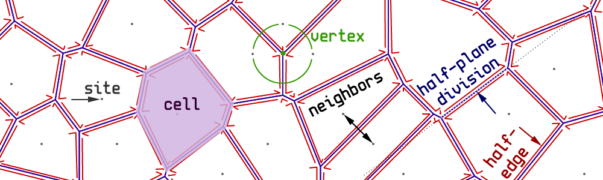

A voronoi diagram is a graph that sections off sites (points) into cells, whereby any point in each cell is closer to the cell's site, than any other site. It is infrequently referred to as the "Post Office Problem".
 
**Site**: 2D point
 
**Cell**: Container about site, the intersection of all half-planes that divide the site from all other sites. The perimeter is defined by a set of half-edges (typically ordered sequentially CCW or CW about the site). Any point inside the cell is closer to that cell's site than any other site.
 
**Half-Edge**: An edge simply defined a border, but half-edges also enable 'ownership' of each side of a border. They also allow each side to be orientated independently of the opposite.
 
**Neighbors**: Cells that share adjacent half-edges.
 
**Vertex**: A point that is equidistant from three or more sites - a half-edge is geometrically defined by the connection of two vertexes.
 

## Fortune Algorithm
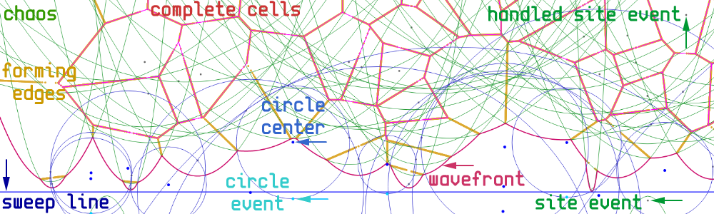
 
Fortune's Algorithm (Steve Fortune 1986) is an optimal process for producing a voronoi diagram (graph) from a set of input sites in the 2D plane. The process can move from left-right, or up-down, but is assumed here to be top-down.
 
**Sweep Line**: A common directrix used by all the arcs in the wavefront. It continuously moves top-down, where all sites above this line have been processed and all sites below await potential evaluation.
 
**Wavefront (Beach Line)**: The set of arcs defined by the lowest points over all parabolas (of sites above the sweep line).
 
**Site Event (Split)**: An input site before being processed - the site's location is defined as the site's position.
 
**Circle Event (Merge)**: A convergence of three parabolas (which defines a circle) - the site's location is defined as the lowest point of the circle.
 
**False Alarm**: If a new site 'shows up' causing a circle event to be rendered mute, the circle event is referred to as a 'false alarm'.
 

### Data Structures
The Fortune Algorithm uses several tools to keep track of all the information required for the algorithm.
 
**Event Queue [Q]**: This contains all site and circle events - they are ordered based on the times at which they will arrive at the sweep line: Events with a higher y value will appear before events with a lower y value. Events with the same y value can further be sorted based on their x value (increasing or decreasing doesn't matter as long as it's consistent).
 
**Voronoi Graph [G]**: This contains all vertexes and half-edges (and sites) that are added as the algorithm progresses. When complete, this is the output of the algorithm.
 
**Wavefront [W]**: This is a set of arcs (parabola segments) which serves as a way to keep track of the lowest parabola segments, as well as predict points of future convergence (which correspond to voronoi vertexes)
 

### Algorithm

- Graph initialized empty
- Queue initialized with n input site events
- While Queue not empty
  - Site Event (split):
    - find arc above new site
    - remove old circle event for site if present (false alarm)
    - add new arc (formed by site) to wavefront (which is a vertical line)
    - graph add: new half-edge
    - check for possible circle events "triplets"
  - Circle Event (merge):
      - remove all circle from queue events that reference the merging arc
    - graph add: new vertex, 1 new half-edge
    - collapse referenced arc (remove from wavefront)
    - check for 2 possible circle events "triplets" formed by left 3 and right 3 sites
      - the center of the event is where the left/right arc may disappear, the bottom is the event location
      - converging arcs: focus are oriented Left-Center-Right about circle event center
- Cleanup Graph when Queue is empty
  - Combine coincident vertexes (where multiple events occurred simultaneously = valence 4+ vertex)
  - Consistently orientate half-edges around site
  - Cap infinite edges (eg via bounding box)

### Sequence
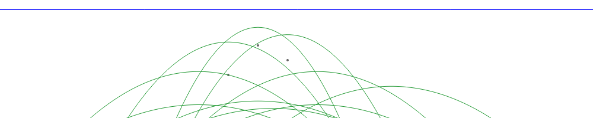
 
*initial empty sites*
 
---
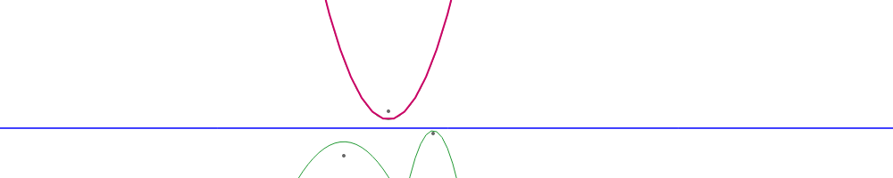
 
*first site/arc added*
 
---
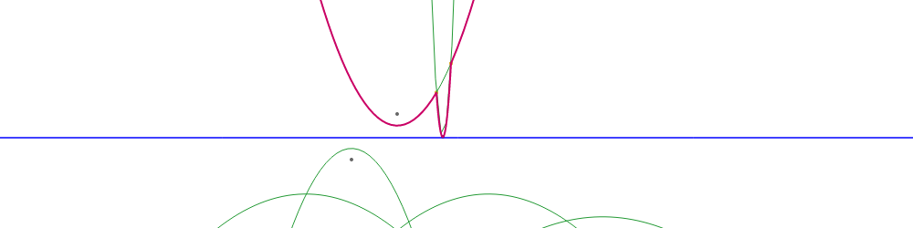
 
*second arc added*
 
---
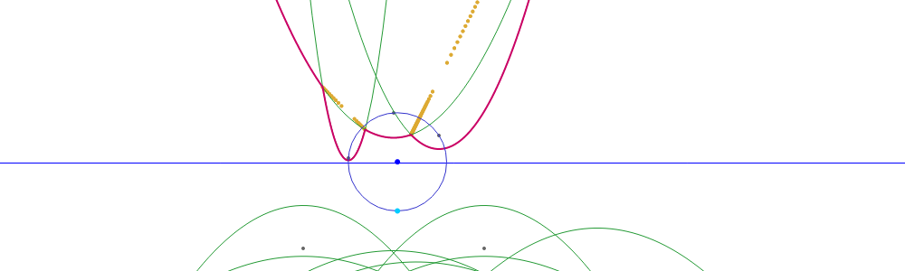
 
*third arc added, and circle event generated showing point of convergence*
 
---
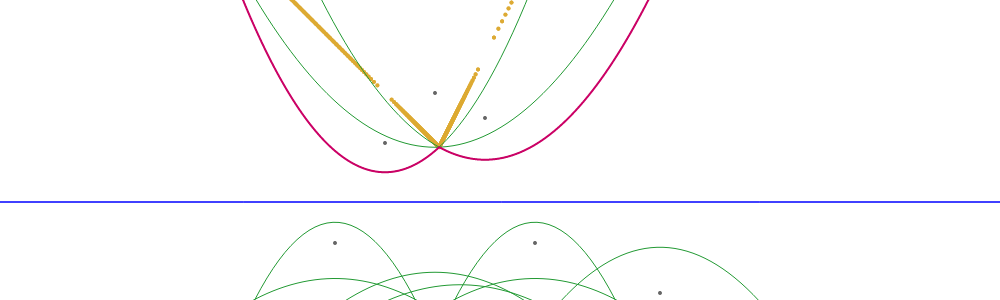
 
*arc convergence*
 
---
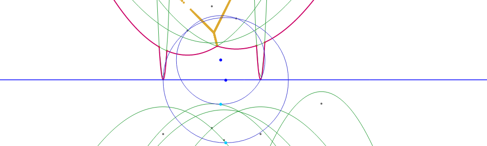
 
*additional sites added, more circle events generated*
 
---
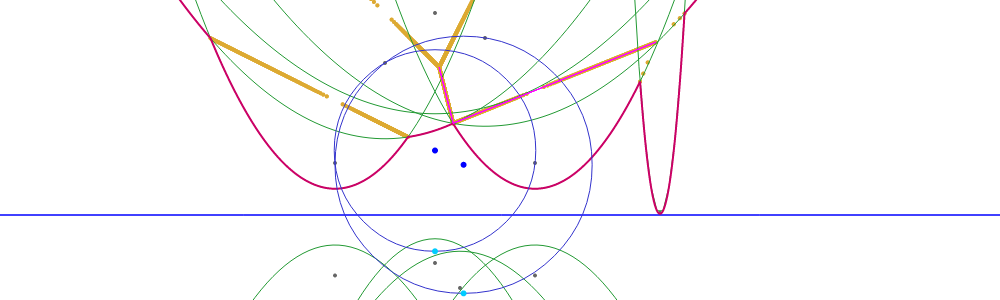
 
*another merge - arcs with definite vertex shown in red*
 
---
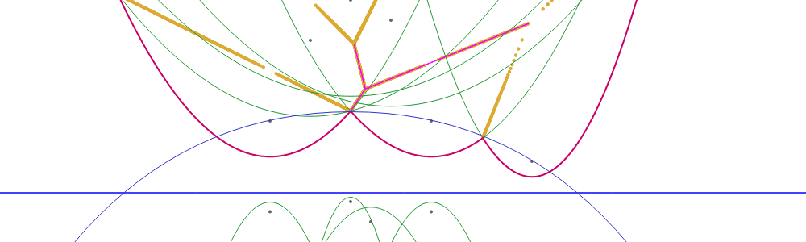
 
*another merge updates wavefront, revealing false-alarm circle event (removed)*
 
---
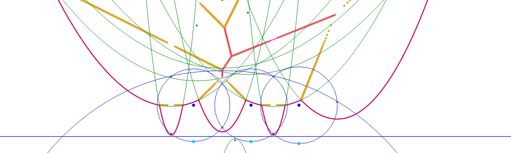
 
*...ad infinitum...*
 
---
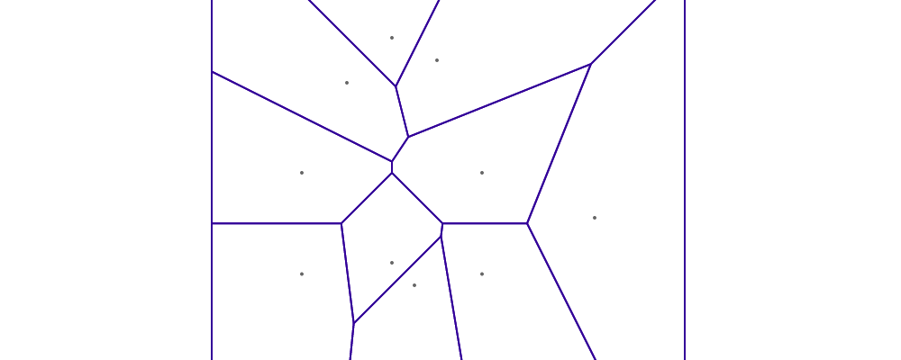
 
*final voronoi diagram*
 
---

## Data Structure Speedup

 
*Optimum-ness of Fortune Algorithm relies on underlying data structures*
 

**Balanced Binary Search Tree: RedBlack**
 
A regular Binary Search Tree (BST) can become lopsided if interaction with it is less than random (or contrived).
The Red-Black Tree is a BST that guarantees non-lopsided ness, and has the following time complexities:
- insert: O(lg(n))
- delete: O(lg(n))
- search: O(lg(n))
 

**List of Operations/Classes/Objects in Fortune Algoritm and Time Complexity O():**
- find arc in wavefront: O(lg(n))
- add arc to wavefront: O(lg(n))
- remove arc from wavefront: O(lg(n))
- remove circle event: O(1)
- add vertex, half-edge, site, to graph: O(1)
- find arc from circle event: O(1)
- check for possible circle events: O(1)
 

Maximum wavefront arcs: 2n-1 (show worst case: vertical sites)
 
Maximum circle events: n (although more do show up as false alarms)
 
Algorithm runtime: O(nlg(n))
 

**Wavefront representations:**
 
set of intersections
 
set of arcs
 

**Notes:**
- avoid methods that are suspect to numerical error
- book-keeping: keep only most pertinent data, as all references need to be updated, and more references = prone to error

 

## Delaunay

 
*Delaunay Diagram / Triangulation* is the 'dual' of the voronoi diagram. This simply means they share common properties/features, which often function equivalently or complimentary.
 
They cannot be called 'inverses', because V(D(X)) != X
 

**Relationships:**
 
- Delaunay triangle edges are orthogonal to Voronoi cell edges
- Delaunay vertexes are Voronoi sites
- The convex hull of Delaunay vertexes is the convex hull of Voronoi sites
- 3 concentric voronoi sites define a vornoi vertex &lrarr; 3 concentric delaunay vertexes define voronoi vertex
- ...
 
- If any voronoi vertex has a valence larger than 3, then the Delaunay ceases to be a triangulation, and faces with more then 3 edges are resulted.

###From Voronoi
- For Each Site:
  - For Each Edge
    - form a triangle from:
      - site
      - edge.opposite.site
      - edge.next.opposite.site

Alone, this will create each triangle 3 times, but doing some limiting based on 'visits' to each edge can result in the complete unique set of delaunay triangles.

---

## References
 
[Voronoy](http://www.google.com/search?q=voronoy)
 
[Delaunay](http://www.google.com/search?q=Robert+Delaunay)
 
[Fortune's Algorithm](http://www.google.com/search?q=Steven+Fortune+Algorithm)
 
 
[Conic Sections](http://www.mathsisfun.com/geometry/conic-sections.html)
 
[Dual / Duality](http://en.wikipedia.org/wiki/Dual_(mathematics))
 

